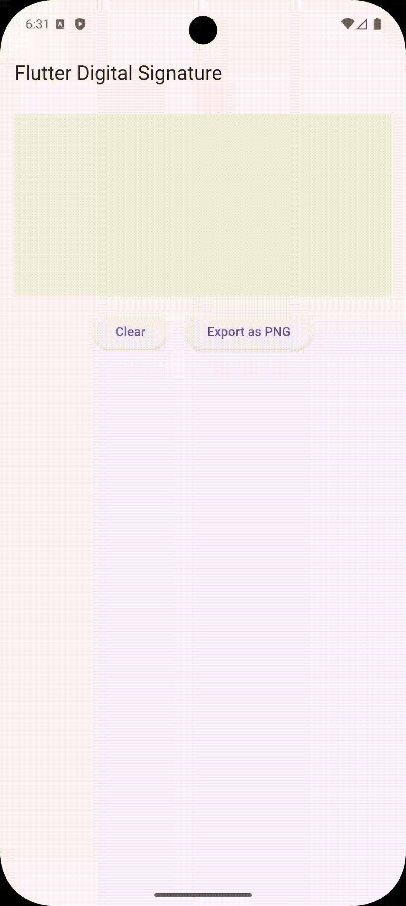

# Flutter Digital Signature

A powerful and flexible digital signature widget for Flutter with 
advanced features including smooth drawing, pressure sensitivity, 
velocity-based stroke width, and export to multiple formats.

## Features
**Smooth Drawing** - Advanced smoothing algorithms for natural signature appearance
**Customizable Appearance** - Control colors, stroke width, and background
**Touch & Stylus Support** - Pressure-sensitive drawing with stylus support
**Multiple Export Formats** - Export to PNG, SVG, or JSON
**Velocity-Based Strokes** - Dynamic stroke width based on drawing speed
**Undo/Clear** - Easy signature management
**Save & Load** - Export and import signature data
**Highly Configurable** - Extensive customization options

## Installation

Add this to your package's `pubspec.yaml` file:

```yaml
dependencies:
  flutter_digital_signature: ^1.0.0
```

Then run:

```bash
flutter pub get
```

## Usage

### Basic Example

```dart
import 'package:flutter/material.dart';
import 'package:flutter_digital_signature/flutter_digital_signature.dart';

class SignaturePage extends StatefulWidget {
  @override
  _SignaturePageState createState() => _SignaturePageState();
}

class _SignaturePageState extends State<SignaturePage> {
  final SignatureController _controller = SignatureController(
    strokeColor: Colors.black,
    strokeWidth: 3.0,
  );

  @override
  Widget build(BuildContext context) {
    return Column(
      children: [
        Row(
          mainAxisAlignment: MainAxisAlignment.center,
          children: [
            _colorButton(Colors.black),
            _colorButton(Colors.blue),
            _colorButton(Colors.red),
            _colorButton(Colors.green),
          ],
        ),
        Expanded(
          child: DigitalSignature(
            controller: controller,
            width: double.infinity,
          ),
        ),
      ],
    );
  }

  Widget _colorButton(Color color) {
    return GestureDetector(
      onTap: () => changeColor(color),
      child: Container(
        width: 40,
        height: 40,
        margin: EdgeInsets.all(8),
        decoration: BoxDecoration(
          color: color,
          shape: BoxShape.circle,
          border: Border.all(
            color: controller.strokeColor == color 
                ? Colors.white 
                : Colors.transparent,
            width: 3,
          ),
        ),
      ),
    );
  }
}
```

### Save Signature to File

```dart
import 'dart:io';
import 'package:path_provider/path_provider.dart';

Future<void> saveSignatureToFile() async {
  final bytes = await controller.toPng(
    width: 800,
    height: 400,
    backgroundColor: Colors.white,
  );
  
  if (bytes != null) {
    final directory = await getApplicationDocumentsDirectory();
    final file = File('${directory.path}/signature_${DateTime.now().millisecondsSinceEpoch}.png');
    await file.writeAsBytes(bytes);
    print('Signature saved to: ${file.path}');
  }
}
```

### Display Signature Preview

```dart
class SignatureWithPreview extends StatefulWidget {
  @override
  _SignatureWithPreviewState createState() => _SignatureWithPreviewState();
}

class _SignatureWithPreviewState extends State<SignatureWithPreview> {
  final controller = SignatureController();
  Uint8List? previewBytes;

  Future<void> generatePreview() async {
    final bytes = await controller.toPng(
      width: 300,
      height: 150,
      backgroundColor: Colors.white,
    );
    setState(() {
      previewBytes = bytes;
    });
  }

  @override
  Widget build(BuildContext context) {
    return Column(
      children: [
        DigitalSignature(
          controller: controller,
          width: double.infinity,
          height: 300,
        ),
        SizedBox(height: 20),
        ElevatedButton(
          onPressed: generatePreview,
          child: Text('Generate Preview'),
        ),
        if (previewBytes != null)
          Padding(
            padding: EdgeInsets.all(16),
            child: Image.memory(previewBytes!),
          ),
      ],
    );
  }
}
```

## Comparison with hand_signature

| Feature | flutter_digital_signature | other package |
|---------|--------------------------|---------------|
| Smooth Drawing | ✅ Advanced smoothing | ✅ Basic       |
| Pressure Sensitivity | ✅ Full support | ⚠️ Limited    |
| Velocity-Based Width | ✅ Yes | ❌ No          |
| PNG Export | ✅ Yes | ✅ Yes         |
| SVG Export | ✅ Yes | ✅ Yes         |
| JSON Export | ✅ Yes | ❌ No          |
| Undo/Redo | ✅ Yes | ✅ Yes         |
| Custom Colors | ✅ Yes | ✅ Yes         |
| Transparent Background | ✅ Yes | ✅ Yes         |
| Callbacks | ✅ onDrawStart/Drawing/End | ⚠️ Limited    |
| Null Safety | ✅ Full support | ✅ Yes         |
| Performance | ✅ Optimized | ✅ Good        |

## Configuration Options

### Stroke Appearance

```dart
SignatureController(
  strokeColor: Colors.blue,        // Stroke color
  strokeWidth: 3.0,                // Base stroke width
  minStrokeWidth: 1.0,             // Minimum width (for pressure/velocity)
  maxStrokeWidth: 8.0,             // Maximum width (for pressure/velocity)
)
```

### Smoothing

```dart
SignatureController(
  smoothing: true,                 // Enable smoothing
  smoothingRatio: 0.65,            // 0.0 (no smoothing) to 1.0 (max smoothing)
)
```

### Velocity-Based Width

```dart
SignatureController(
  velocityBased: true,             // Enable velocity-based width
  velocityFilterWeight: 0.5,       // 0.0 (no effect) to 1.0 (max effect)
)
```

### Pressure Sensitivity

```dart
SignatureController(
  pressureSensitive: true,         // Enable pressure sensitivity
  minStrokeWidth: 1.0,             // Min width for light pressure
  maxStrokeWidth: 6.0,             // Max width for heavy pressure
)
```

## Tips & Best Practices

1. **Performance**: For large signatures, consider limiting the maximum number of points or using a lower smoothing ratio.

2. **Export Quality**: Use higher width/height values when exporting for better quality:
   ```dart
   await controller.toPng(width: 1000, height: 600);
   ```

3. **Touch vs Stylus**: The package automatically detects stylus input and applies pressure sensitivity when available.

4. **Background Color**: For transparent backgrounds in PNG export, don't specify backgroundColor:
   ```dart
   await controller.toPng(); // Transparent background
   ```

5. **Memory Management**: Always dispose the controller when done:
   ```dart
   @override
   void dispose() {
     controller.dispose();
     super.dispose();
   }
   ```

## Troubleshooting

### Signature appears pixelated
Increase the export dimensions:
```dart
await controller.toPng(width: 1000, height: 600);
```

### Strokes are too thick/thin
Adjust stroke width parameters:
```dart
SignatureController(
  strokeWidth: 2.0,
  minStrokeWidth: 0.5,
  maxStrokeWidth: 4.0,
)
```

### Drawing feels laggy
Disable smoothing or reduce smoothing ratio:
```dart
SignatureController(
  smoothing: false,
  // or
  smoothingRatio: 0.3,
)
```

## Contributing

Contributions are welcome! Please feel free to submit a Pull Request.

## License

This project is licensed under the MIT License - see the LICENSE file for details.

## Author

Your Name - [GitHub](https://github.com/yourusername)

## Support

If you find this package useful, please give it a ⭐ on GitHub!

For issues and feature requests, please file an issue on the [GitHub repository](https://github.com/yourusername/flutter_digital_signature/issues).) {
return Scaffold(
appBar: AppBar(title: Text('Digital Signature')),
body: Column(
children: [
Expanded(
child: DigitalSignature(
controller: _controller,
backgroundColor: Colors.white,
width: double.infinity,
height: 300,
),
),
Row(
mainAxisAlignment: MainAxisAlignment.spaceEvenly,
children: [
ElevatedButton(
onPressed: () => _controller.clear(),
child: Text('Clear'),
),
ElevatedButton(
onPressed: () => _controller.undo(),
child: Text('Undo'),
),
ElevatedButton(
onPressed: _exportSignature,
child: Text('Export PNG'),
),
],
),
],
),
);
}

Future<void> _exportSignature() async {
final bytes = await _controller.toPng();
if (bytes != null) {
// Save or use the image bytes
print('Signature exported: ${bytes.length} bytes');
}
}

@override
void dispose() {
_controller.dispose();
super.dispose();
}
}
```

### Advanced Configuration

```dart
final controller = SignatureController(
  strokeColor: Colors.blue,
  strokeWidth: 4.0,
  minStrokeWidth: 1.0,
  maxStrokeWidth: 8.0,
  smoothing: true,
  smoothingRatio: 0.65,
  velocityBased: true,
  velocityFilterWeight: 0.5,
  pressureSensitive: true,
);
```

### Export Options

#### Export to PNG

```dart
final pngBytes = await controller.toPng(
  width: 500,
  height: 300,
  backgroundColor: Colors.white,
);
```

#### Export to SVG

```dart
final svgString = controller.toSvg(
  width: 500,
  height: 300,
  backgroundColor: Colors.white,
);
```

#### Export to JSON

```dart
final jsonData = controller.toJson();
// Save to database or file

// Later, load it back
controller.fromJson(jsonData);
```
Example 

### Callbacks

```dart
DigitalSignature(
  controller: controller,
  onDrawStart: () => print('Started drawing'),
  onDrawing: () => print('Drawing...'),
  onDrawEnd: () => print('Finished drawing'),
)
```

## API Reference

### SignatureController

The main controller for managing signature drawing and export.

#### Constructor Parameters

- `strokeColor` (Color): Color of the signature stroke (default: Colors.black)
- `strokeWidth` (double): Base width of the stroke (default: 3.0)
- `minStrokeWidth` (double): Minimum stroke width for variable width (default: 1.0)
- `maxStrokeWidth` (double): Maximum stroke width for variable width (default: 6.0)
- `smoothing` (bool): Enable stroke smoothing (default: true)
- `smoothingRatio` (double): Smoothing intensity 0.0-1.0 (default: 0.65)
- `velocityBased` (bool): Enable velocity-based stroke width (default: true)
- `velocityFilterWeight` (double): Velocity effect strength (default: 0.5)
- `pressureSensitive` (bool): Enable pressure sensitivity (default: true)

#### Methods

- `clear()` - Clear all strokes
- `undo()` - Undo the last stroke
- `isEmpty` - Check if signature is empty
- `isNotEmpty` - Check if signature has content
- `toPng()` - Export signature as PNG
- `toSvg()` - Export signature as SVG
- `toJson()` - Export signature data as JSON
- `fromJson()` - Import signature from JSON

### DigitalSignature Widget

The main widget for displaying and capturing signatures.

#### Properties

- `controller` (SignatureController): Required controller
- `backgroundColor` (Color?): Background color
- `decoration` (BoxDecoration?): Custom decoration
- `width` (double?): Widget width
- `height` (double?): Widget height
- `onDrawStart` (VoidCallback?): Called when drawing starts
- `onDrawing` (VoidCallback?): Called while drawing
- `onDrawEnd` (VoidCallback?): Called when drawing ends

## Advanced Examples

### Custom Styled Signature Pad

```dart
DigitalSignature(
  controller: controller,
  width: double.infinity,
  height: 400,
  decoration: BoxDecoration(
    color: Colors.grey[100],
    border: Border.all(color: Colors.blue, width: 2),
    borderRadius: BorderRadius.circular(12),
    boxShadow: [
      BoxShadow(
        color: Colors.black26,
        blurRadius: 10,
        offset: Offset(0, 4),
      ),
    ],
  ),
)
```

### Multiple Signature Colors

```dart
class MultiColorSignature extends StatefulWidget {
  @override
  _MultiColorSignatureState createState() => _MultiColorSignatureState();
}

class _MultiColorSignatureState extends State<MultiColorSignature> {
  final controller = SignatureController();
  
  void changeColor(Color color) {
    setState(() {
      controller.strokeColor = color;
    });
  }

  @override
  Widget build(BuildContext context

# This package is develop by Ritesh Sahu on 15th Oct'2025